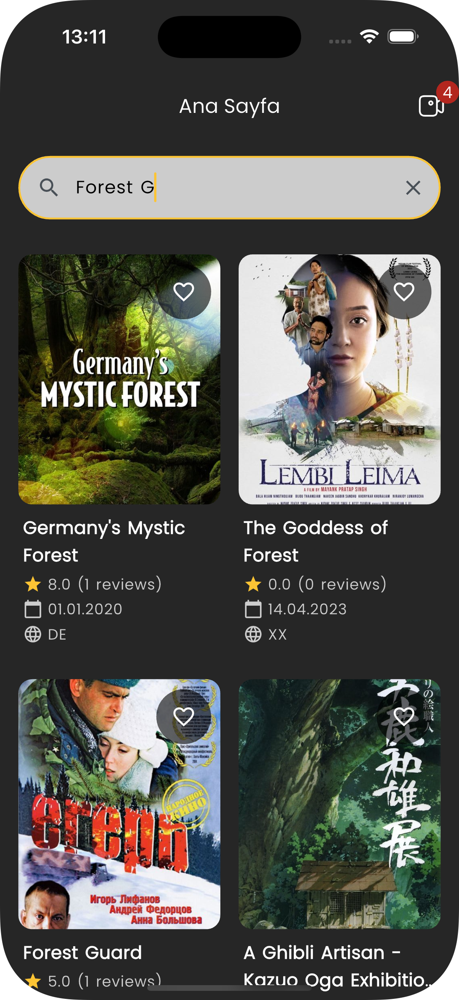
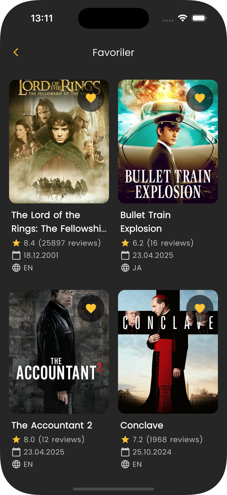
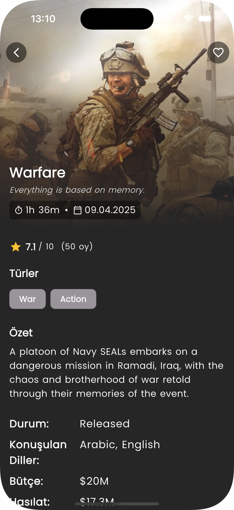

# TMDB Film Uygulaması

Bu uygulama, The Movie Database (TMDB) API'sini kullanarak trend filmleri listeleyen, film araması yapabilen, detayları görüntüleyebilen ve favorilere ekleyebilen bir Flutter uygulamasıdır.

## Özellikler

- 🎬 **Trend Filmler:** Ana sayfada güncel trend filmleri görüntüleme
- 🔍 **Film Arama:** İsme göre film arama
- ❤️ **Favoriler:** Beğendiğiniz filmleri favorilere ekleme ve yönetme
- 📋 **Film Detayları:** Seçilen film hakkında detaylı bilgileri görüntüleme
- 🌙 **Koyu Tema:** Göz yorgunluğunu azaltan şık tasarım

## Kullanılan Teknolojiler

- **Flutter:** Çapraz platform mobil uygulama geliştirme çerçevesi
- **Hive:** Favorileri yerel depolamak için kullanılan NoSQL veritabanı
- **Dio:** API istekleri ve veri alışverişi için HTTP istemcisi
- **Riverpod:** Uygulama genelinde durum yönetimi için kullanılan state management çözümü
- **Lottie:** Zengin ve interaktif animasyonlar için kullanılan kütüphane
- **Toastification:** Kullanıcı bildirimlerini göstermek için kullanılan kütüphane

## Mimari

Uygulama, özellik tabanlı bir mimari yapı kullanmaktadır:

- **core:** Modeller, servisler ve genel yardımcı sınıflar
- **config:** Tema, renkler, yönlendirme ve genel widget'lar
- **features:** Uygulama özellikleri (Ana sayfa, Favoriler, Detaylar)

Her özellik kendi içinde alt bileşenlere ayrılmıştır:
- screens: Ekran widget'ları
- widgets: Özelliğe özgü widget'lar
- providers: Durum yönetimi
- repository: Veri kaynakları ile iletişim

## Ekran Görüntüleri

  
  
  
  

mkdir -p assets/screenshots

